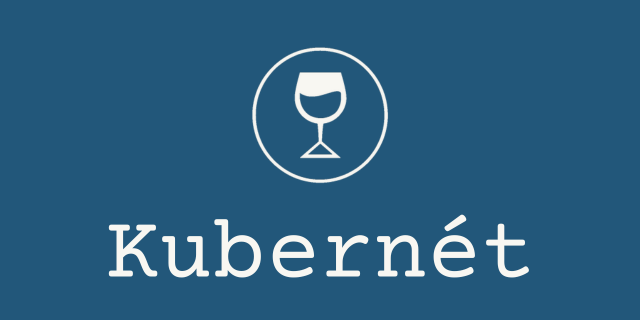
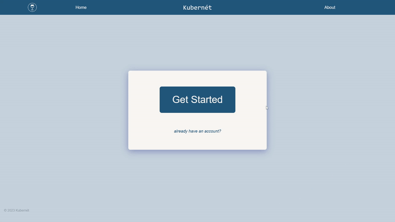
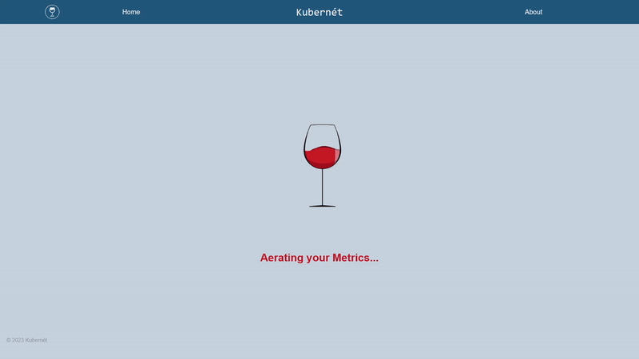

<div align='center'>

---


[](https://medium.com/@username)


</div>

<div align='center'>

• [Introduction](#introduction)• [Getting started](#getting-started) • [Installation](#installation) • [Considerations](#considerations) • [Meet The Team](#meet-the-team) •

</div>

## Introduction

Kubernét is a user-friendly solution for effortlessly visualizing and monitoring your Kubernetes metrics in real-time. No coding or technical expertise needed! Through the intuitive interface, Kubernét simplifies the complex task of tracking and analyzing your K8s cluster metrics.

Before using our application, be sure to have your kubernetes cluster running and have installed helm.

- If you have not installed helm before, install helm from [here](https://helm.sh/docs/intro/install/).

## Getting Started

To get started with opening the web application, first pull this repo onto your machine. In order to have the application work, you will need to create an .env file to store your mongo-URI. within your .env file please type the following:

```js
MONGO_URI = '<mongodb URI>';
```

Once that file is created, open the terminal and type in

```bash
npm start
```

On your browser, localhost:8080 should appear, and you are now running our application!

If this is your first time using the application hit the **Get Started** button. If you have an account with the application already, hit the _already have an account_ button.



_Once you type in your username and password, the application will direct you to login. Make sure the username you are inputting is unique!_

## Installation

After typing in your credentials, our application will begin the process of install Prometheus and Grafana onto your Kubernetes cluster through helm and apply our custom .yaml files.



The dashboard will be saved onto your profile and be displayed on the application.

Your cluster metrics are now visible in real-time and update automatically! Feel free to move around the dashboard and customize the panel layout!


## Considerations

The application requires several default port configurations, so be sure not to populate these ports!

| Port | Application |
| :--: | :---------: |
| 9090 | Prometheus  |
| 8080 |  Kubernét   |
| 3000 |   Grafana   |
| 5050 |   Express   |

## Meet The Team

<table align="center">
<tr>
<td align="center" width="18%"><a href="https://www.linkedin.com/in/paaoul"><br /><sub><b>Paul Lee</b></sub></a><br /><a href="https://www.linkedin.com/in/paaoul/" title="LinkedIn">🐛</a> <a href="https://github.com/paaoul" title="Github">💻</a></td>
<td align="center" width="18%"><a href="https://www.linkedin.com/in/jimmytran48"><br /><sub><b>Jimmy Tran</b></sub></a><br /><a href="https://www.linkedin.com/in/jimmytran48/" title="LinkedIn">🐛</a> <a href="https://github.com/JimmyTran48" title="Github">💻</a></td>
<td align="center" width="18%"><a href="https://www.linkedin.com/in/joseph-w-caballero"><br /><sub><b>Joseph Caballero</b></sub></a><br /><a href="https://www.linkedin.com/in/joseph-w-caballero/" title="LinkedIn">🐛</a> <a href="https://github.com/Joseph-Caballero" title="Github">💻</a></td>
<td align="center" width="18%"><a href="https://www.linkedin.com/in/praiseemmanuel"><br /><sub><b>Praise Emmanuel</b></sub></a><br /><a href="https://www.linkedin.com/in/praiseemmanuel/" title="LinkedIn">🐛</a> <a href="https://github.com/praisepelumi" title="Github">💻</a></td>
</tr>
</table>
